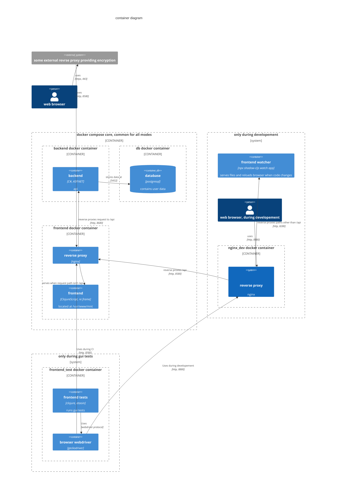

# Containers

## Backend

Backend Contains compiled asp.net app from `backend/`, listens on port `8680`

## Frontend

Frontend is an Nginx container serving compiled to js & html `frontend/`, listens on port `8580`

## How it's all connected

